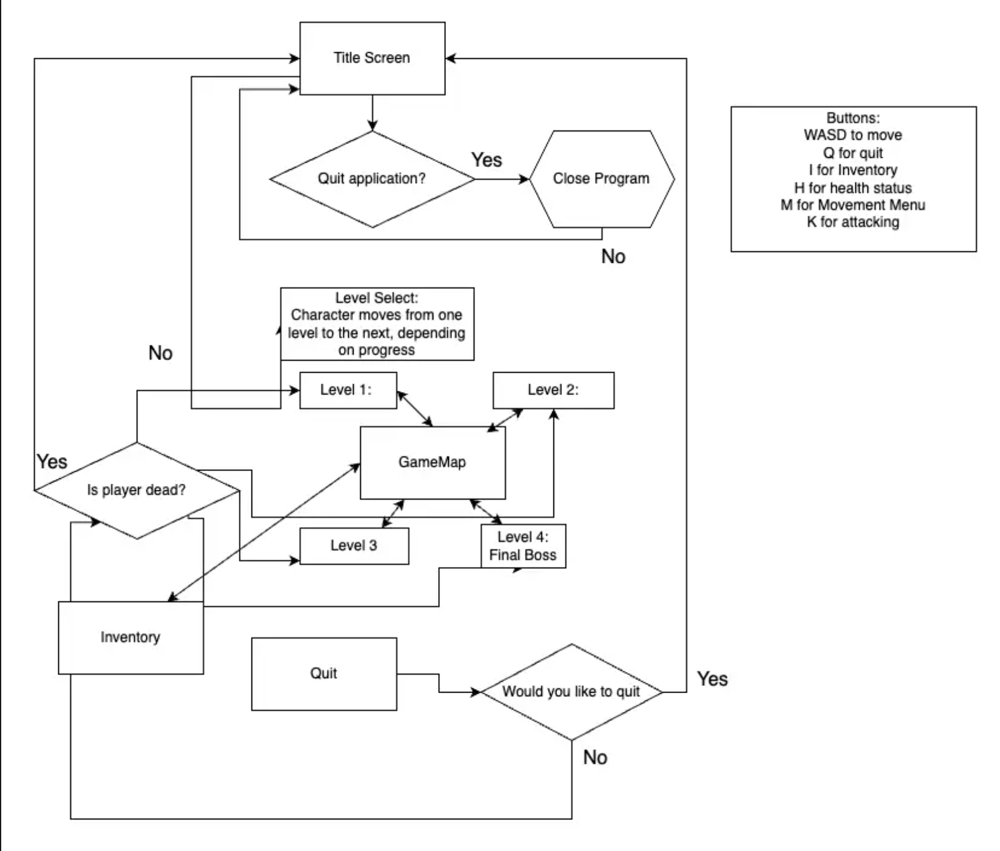

# Radiant-Tactics-2
## Project Description
We had completed almost all the major functionality and features that were listed in our original proposal. The main functionalities of our dungeon crawler were to allow the user to engage in a turn-based battle system on an 11x11 2d grid. This game has an added functionality of being able to wrap around the map like in pac man. There are three different maps with different enemies to fight. The user can to move and attack, use the inventory, and use market. The enemy can do the same and "chase" the player. The enemy should also be able to drop currency that the user can use in the shop. Therefore, in order to accomplish the major necessary functionalities of the game, we decided to swap this idea with the shop concept. We also accomplished different enemy types, different player types, and different weapon types. We also added different animations in the terminal to make the game more enjoyable for the user. The player and enemies take turns moving one square at a time, unless they become adjacent to eachother, where they take turns attacking eachother, or the user can use their inventory to heal or use a weapon.

## Class Diagram

## Use Case Diagram

## Navigation Diagram

