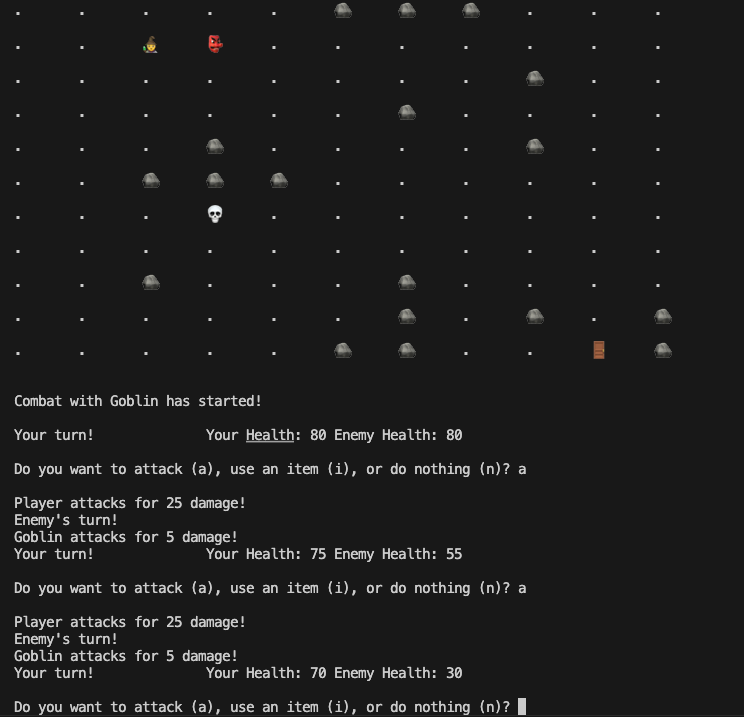

# Radiant-Tactics-2
## Project Description:
The main functionalities of our dungeon crawler are to allow the user to engage in a turn-based battle system on an 11x11 2d grid, progressing through the doors to get to the next map, killing enemies if need be. This game has an added functionality of being able to wrap around the map like in pac man. There are three different maps with different enemies to fight. The user can to move and attack, use the inventory, and use market. The enemy can do the same and "chase" the player. The enemy should also be able to drop currency that the user can use in the shop. Therefore, in order to accomplish the major necessary functionalities of the game, we decided to swap this idea with the shop concept. We also accomplished different enemy types, different player types, and different weapon types. We also added different animations in the terminal to make the game more enjoyable for the user. The player and enemies take turns moving one square at a time, unless they become adjacent to eachother, where they take turns attacking eachother, or the user can use their inventory to heal or use a weapon.

## Class Diagram:
The relationships between all of the classes and there functions within them:
  
Object is an abstract class, as well as character which inherits from object. Each of the players and enemies will inherit from character. The player contains an inventory which contains functions to get items. The Game Manager class manages the logic of the game, including the player's turn, and  enemy's turn. The game map is essentially an array of pointers to these characters or objects that inherit from the object class. The null initialized objects can either represent a door or a barrier, and are represented as so on the map.  
## Use Case Diagram:
Describes the actors in the game and what they can do:
  
## Navigation Diagram:
The rough structure or flow of the game:
  
## Screen Layouts:
### Start Screen:
  
### Combat:
  
### Using Potions:
  
### Using Market:
  
## Installation/Usage
cmake .  
make  
./bin/game  
## Testing
We used the GoogleTest framework to write some unit tests for our code.
